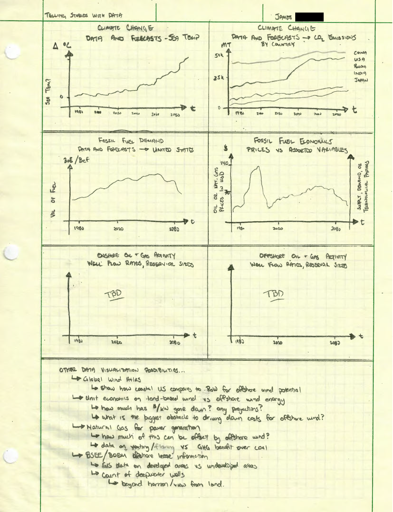

## Final Project Part 1 - Proposal

I am interested in showing that offshore oil and gas is a good alternative to fracking in shale formations and will serve to provide a long term benefit to the renewable energy industry.

High profile Presidential candidates have advocated for a ban on hydraulic fracturing (fracking).
This is a highly charged issue that has a wide range of important implications on people's lives. 

There is a lack of understanding of the oil and gas industry from a technical standpoint, a lack of acknowledgement of how the industry is connected to the rest of the real economy, and an incomplete discussion around how to transition to an energy mix more reliant on alternative energy.

Discuss the North Sea oilfield and the adoption of alternative energy in Norway and UK.
They likely have very little onshore oil and gas activity. I suspect, with the exception of the Piper Alpha tragedy, that they have a great safety record. My hypothesis would be that because the industry is very focused on offshore operations, the corporations develop a high degree of specialization at the same time the regulatory body is focused on a smaller quantity of operations.

Discuss how building up the offshore industry leads to building up the capability for offshore wind installations. When commissioning a fixed or floating wind turbine installation, you need support vessels, service providers who have critical skills (think of Halliburton/Schlumberger and their cementing operations), and equipment manufacturers to push the boundaries of current technology (subsea pumping stations for O&G - how about subsea electrical substations for offshore wind? super high voltages = smaller conductors = lower costs, etc).

One of the big uses of natural gas (from fracking) is to produce electricity - offset this with offshore wind farms? How many, how much, how expensive, how feasible is this idea?

Was the Deepwater Horizon a catastrophe? Yes absolutely. The loss of life was the worst part. 

Attempt to put the economic and environmental damage in perspective with what is anticipated for climate change. Are they similar? Is there an order of magnitude difference? Several orders of magnitude? 

Story Arc

Setup - we use a lot of oil and gas. Cars, petrochemicals, plastics. We have a lot of oil and gas activity as a result.

Conflict - political pressures to ban fracking, eliminate fossil fuels, and adopt renewable energy sources vs corporate and global economic pressures to maintain status quo.

Resolution - minimize immediate health and environmental impact by shifting to more offshore wells, develop capability, technology and infrastructure to build out offshore wind projects.

User stories

Oil and gas roughneck, Presidential candidate, young professional living in Boston, climate change activist, oil & gas executive.

Call to action: encourage the development of offshore oil and gas when available, as it serves the needs of the country and the planet. 

## Initial Sketches

My initial sketches are shown below. They follow the intended story arc, which serves to show that the United States (and world at large) has tremendous energy needs that only increase over time. 

A transition to renewable energy sources will take time, due to financial constraints and other macro economic factors. In the meantime, drilling offshore will allow for less drilling activity due to the larger reservoir sizes and higher flow rates. Less drilling activity leads to better environmental, health, and safety outcomes. 

Currently, offshore wind energy is complex and the industry struggles with being profitable. 

The oil & gas industry has learned many, many hard lessons over the past 50+ years and has a group of professionals with tacit knowledge which could help the offshore wind industry. 

Partering would get the world "farther along" than continuing to have an adversarial relationship.

## Data
All data necessary for the idea of unconventional (fracking) vs offshore oil and gas production is available via the EIA. The link to the Excel Add-in is available in the Sources section. The datasets can be downloaded here: [EIA Data](Offshore/EIA%20and%20FRED%20data.xlsx)

There are several opportunities for GIS visualizations of offshore wind potential, onshore drilling activity, offshore platform locations, etc. I will selectively use these data in order to reinforce specific points about the magnitude of the oil and gas industry, as well as to highlight the amount of overlap between it and offshore wind.

## Method and Medium
The presentation and story will be told via Shorthand. I am looking forward to learning how to use the platform.

## Sources
[Global Wind Atlas](https://globalwindatlas.info/)

[Global Carbon Atlas](http://www.globalcarbonatlas.org/en/CO2-emissions) 

[McKinsey North American Gas Outlook to 2030](https://www.mckinsey.com/industries/oil-and-gas/our-insights/north-american-gas-outlook-to-2030) 

[EIA - Natural gas venting and flaring increased in North Dakota and Texas in 2018](https://www.eia.gov/todayinenergy/detail.php?id=42195)

[US Department of the Interior - Bureau of Ocean Energy Management - GOMR Geographic Information System (GIS) Data and Maps](https://www.boem.gov/oil-gas-energy/mapping-and-data/gomr-geographic-information-system-gis-data-and-maps) 

[NASA Global Climate Change](https://climate.nasa.gov/resources/global-warming-vs-climate-change/)

[Our World in Data - CO2 and Greenhouse Gas Emissions](https://ourworldindata.org/co2-and-other-greenhouse-gas-emissions) 

[US Energy Information Administration and St. Louis Federal Reserve Excel Add-in (~1.8 million datasets)](https://www.eia.gov/opendata/excel/)

## Return to Main Portfolio Page

[Take me Back](README.md)
